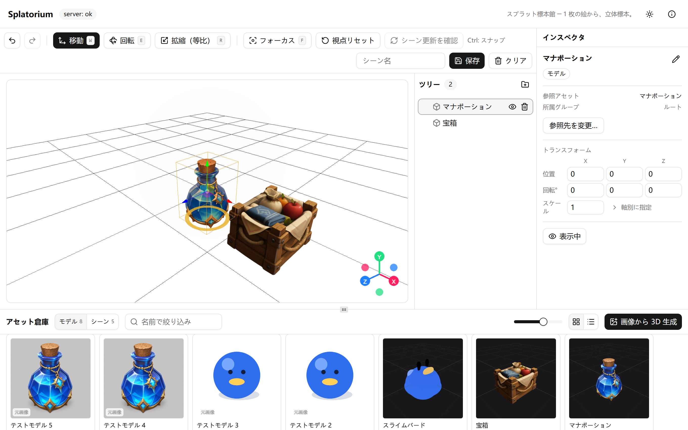
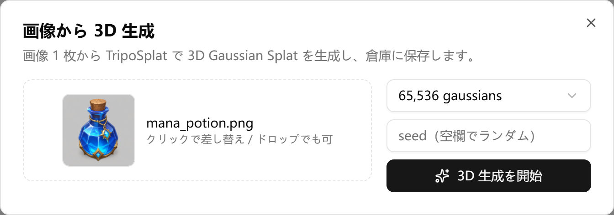
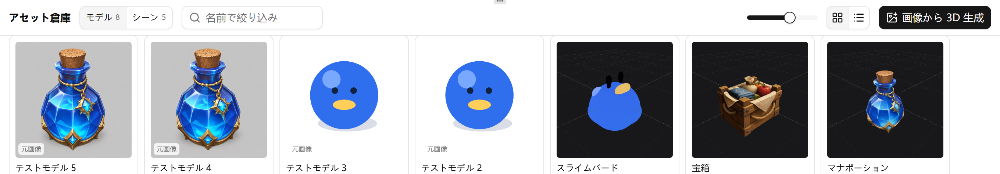

# Splatorium

**One image in, a 3D specimen out.**

Splatorium is a local 3D workbench that uses ComfyUI and TripoSplat to turn an image into a 3D Gaussian Splat. You can organize generated models in a browser-based collection, arrange several models in a scene, and share the same collection with devices on your LAN.



## Features

- **Generate** — create a 3D Gaussian Splat from one image (65,536 / 131,072 / 262,144 gaussians)
- **Organize** — view, rename, search, and delete models and scenes in one collection
- **Compose** — translate, rotate, and scale multiple models, groups, and nested scenes
- **Share** — use the same collection and scenes from browsers on your LAN

| Choose an image and generate | Find the completed model in the collection |
|---|---|
|  |  |

## Use the Portable Release

The Portable Release is for 64-bit Windows 10 or 11. See the user guide for detailed system requirements.

1. Open the [latest GitHub Release](https://github.com/Hitsuki-Ban/Splatorium/releases/latest) and download `SplatoriumPortable.zip` from Assets.
2. Extract the complete ZIP to a writable folder.
3. Follow the [Portable User Guide](docs/user-guide.md) to add Node.js, ComfyUI, and the model files, then run `run.bat`.

The Portable ZIP contains Splatorium and its launch scripts. It does not contain the Node.js runtime, ComfyUI, or model files.

## Run from source

You need Node.js 22 or later and pnpm 10.33.1. Image-to-3D generation also requires a separately configured ComfyUI installation.

```sh
pnpm install --frozen-lockfile
pnpm dev
```

The development command serves the web interface at `http://localhost:6173` and the Splatorium server at `http://localhost:8787`. See [ComfyUI setup for source builds](docs/setup-comfyui.md) for the ComfyUI connection. Instructions for building the Portable ZIP are in the [user guide](docs/user-guide.md#build-the-portable-package-from-source).

## Repository layout

```text
apps/web          web interface (Vite + React + Three.js / Spark)
apps/server       API, job queue, ComfyUI integration, and collection
packages/shared   schemas and utilities shared by the web interface and server
comfy/            ComfyUI workflows and model list (model files are not included)
docs/             documentation for users and external contributors
```

## Documentation

- [Portable User Guide (English)](docs/user-guide.md)
- [Portable ユーザーマニュアル（日本語）](docs/user-guide.ja.md)
- [Architecture (Japanese)](docs/architecture.md)
- [API reference (Japanese)](docs/api.md)
- [ComfyUI setup for source builds (Japanese)](docs/setup-comfyui.md)
- [Required model files (Japanese)](comfy/models.md)

## License

The source code is available under the [MIT License](LICENSE). Notices for dependencies and distributed components are listed in [third-party-licenses.md](third-party-licenses.md).

**Built with DINOv3.** The generation pipeline uses a DINOv3-derived vision encoder. Model files are not included in this repository, and the [DINOv3 License](licenses/dinov3/LICENSE.md) applies to their use.

---

*日本語版は [README.md](README.md) へ。*
