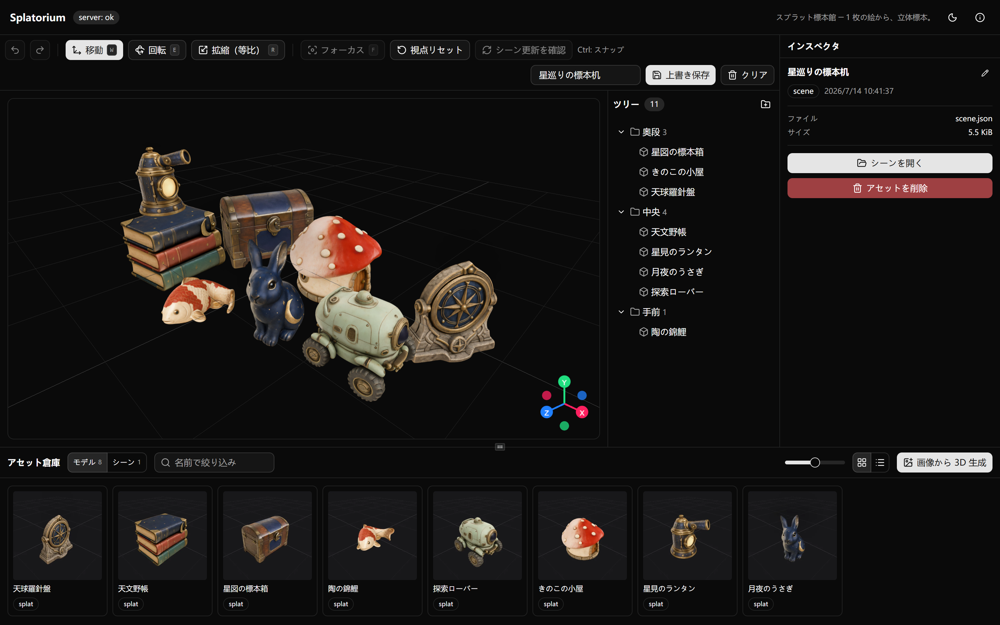
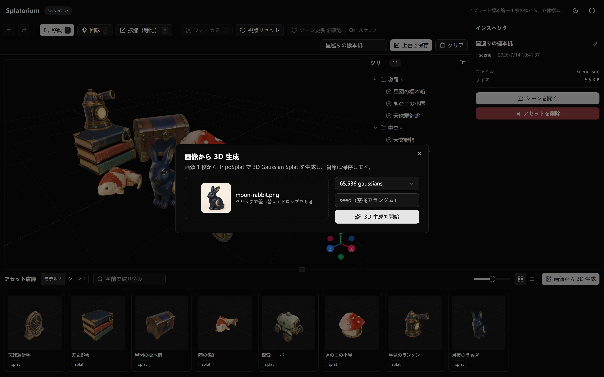
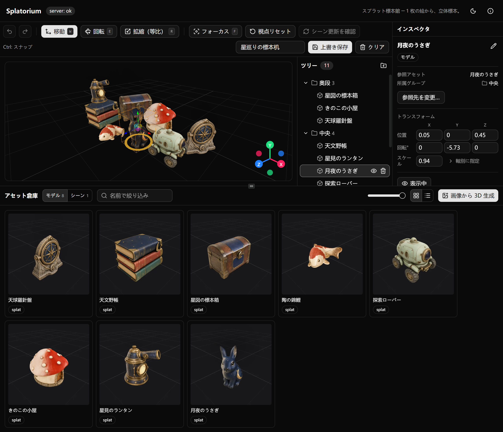
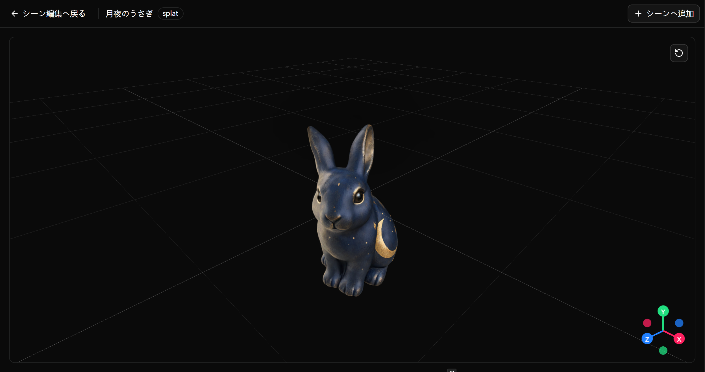
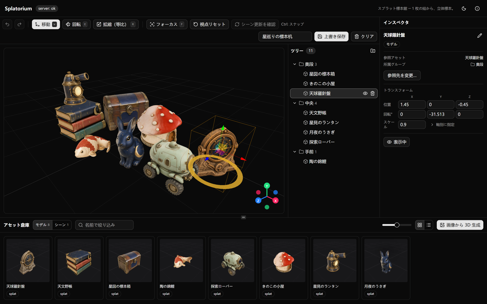

# Splatorium ─ スプラット標本館

**1 枚のイメージから、あなただけの 3D コレクションへ。**

Splatorium は、画像から 3D Gaussian Splat を作り、ブラウザ上で集めて並べられるローカル 3D ワークベンチです。生成には ComfyUI と TripoSplat を使用します。完成したモデルとシーンは手元に保存され、同じ LAN 上の端末からも利用できます。

<picture>
  <source media="(max-width: 720px)" srcset="docs/showcase/shots/hero-mobile.png">
  
</picture>

## 主な機能

- **生成** — 画像 1 枚から 3D Gaussian Splat を生成（65,536 / 131,072 / 262,144 gaussians）
- **整理** — モデルとシーンを 1 つの倉庫で表示・名前変更・検索・削除
- **構成** — 複数のモデルを移動・回転・拡縮し、グループや子シーンとして配置
- **共有** — 同じ LAN 上のブラウザから共通の倉庫とシーンを利用

## 画像からシーンまで

### 1. Generate — 画像からモデルを作る

気に入った画像を選び、モデルの細かさを決めたら生成を開始します。作業状況は同じ画面で確認できます。



### 2. Organize — 倉庫で集めて確かめる

完成したモデルは倉庫に自動で並びます。名前やサムネイルを見ながら探し、気になるモデルを開いて好きな角度から確認できます。





### 3. Compose — 自分のシーンを作る

モデルをシーンへ追加し、移動・回転・拡縮しながら構成します。複数のモデルを組み合わせた場面を保存して、いつでも続きを楽しめます。



## Portable Release を使う

Portable Release は 64 ビット版 Windows 10 / 11 向けです。詳しい動作環境はユーザーマニュアルを参照してください。

1. [最新の GitHub Release](https://github.com/Hitsuki-Ban/Splatorium/releases/latest)を開き、Assets から `SplatoriumPortable.zip` をダウンロードします。
2. ZIP 全体を書き込み可能なフォルダーへ展開します。
3. [Portable ユーザーマニュアル（日本語）](docs/user-guide.ja.md)に従って Node.js、ComfyUI、モデルファイルを用意し、`run.bat` を実行します。

Portable ZIP には Splatorium 本体と起動スクリプトが含まれます。Node.js ランタイム、ComfyUI、モデルファイルは含まれません。

## ソースから実行する

必要なバージョンは Node.js 22 以降と pnpm 10.33.1 です。画像からの生成には、別途 ComfyUI の設定が必要です。

```sh
pnpm install --frozen-lockfile
pnpm dev
```

開発サーバーは Web 画面を `http://localhost:6173`、Splatorium サーバーを `http://localhost:8787` で起動します。ComfyUI の接続方法は[ソース実行向け ComfyUI 設定](docs/setup-comfyui.md)を参照してください。Portable ZIP の構築方法は[ユーザーマニュアル](docs/user-guide.ja.md#ソースから-portable-パッケージを構築する)に記載しています。

## リポジトリ構成

```text
apps/web          Web 画面（Vite + React + Three.js / Spark）
apps/server       API、ジョブキュー、ComfyUI 連携、倉庫
packages/shared   Web 画面とサーバーで共有するスキーマとユーティリティ
comfy/            ComfyUI ワークフローとモデル一覧（モデル本体は含まない）
docs/             ユーザーおよび外部コントリビューター向け文書
```

## ドキュメント

- [Portable ユーザーマニュアル（日本語）](docs/user-guide.ja.md)
- [Portable User Guide (English)](docs/user-guide.md)
- [アーキテクチャ](docs/architecture.md)
- [API リファレンス](docs/api.md)
- [ソース実行向け ComfyUI 設定](docs/setup-comfyui.md)
- [必要なモデルファイル](comfy/models.md)

## ライセンス

ソースコードは [MIT License](LICENSE) で提供されます。依存ソフトウェアと同梱物の表記は [third-party-licenses.md](third-party-licenses.md) を参照してください。

**Built with DINOv3.** 生成パイプラインは DINOv3 由来のビジョンエンコーダを使用します。モデルファイルはこのリポジトリに含まれず、利用には [DINOv3 License](licenses/dinov3/LICENSE.md) が適用されます。

---

*Read this in [English](README.en.md).*
